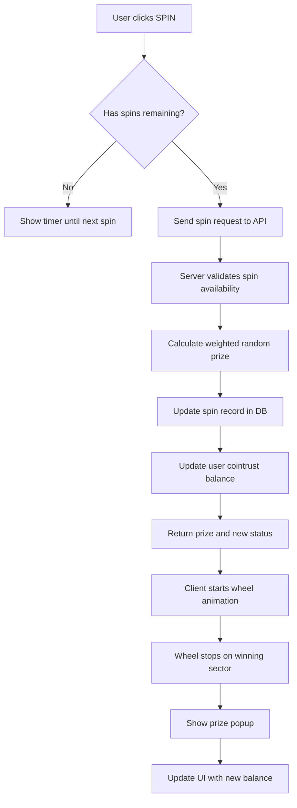

# Fortune Wheel Game - Detailed Implementation Plan

## Overview

A Fortune Wheel mini-game for the Influton Telegram Mini App where users can spin a wheel to win cointrust coins.

### Game Mechanics
- **3 free spins per day** with 8-hour recovery time per spin
- **8 prize sectors** with different coin amounts and probabilities
- Prizes are added directly to user's cointrust balance
- Visual spinning animation with satisfying UX

---

## Prize Structure

| Sector | Prize | Probability | Color |
|--------|-------|-------------|-------|
| 1 | 10 coins | 30% | #FF6B6B |
| 2 | 25 coins | 25% | #4ECDC4 |
| 3 | 50 coins | 18% | #45B7D1 |
| 4 | 100 coins | 12% | #96CEB4 |
| 5 | 250 coins | 8% | #FFEAA7 |
| 6 | 500 coins | 4% | #DDA0DD |
| 7 | 1000 coins | 2.5% | #98D8C8 |
| 8 | JACKPOT 5000 | 0.5% | #FFD700 |

---

## Technical Architecture

### File Structure

```
influton-app/
├── models/
│   └── spinModel.js          # NEW: Spin tracking model
├── routes/
│   └── wheel.js              # NEW: Wheel API routes
├── services/
│   └── wheelService.js       # NEW: Wheel business logic
├── views/
│   └── wheel.ejs             # NEW: Wheel game page
└── public/images/
    └── wheel-pointer.png     # NEW: Wheel pointer image
```

---

## Backend Implementation

### 1. Spin Model (models/spinModel.js)

```javascript
const mongoose = require('mongoose');

const SpinSchema = mongoose.Schema({
  userId: { 
    type: String, 
    ref: 'User', 
    required: true,
    index: true 
  },
  spinsRemaining: { 
    type: Number, 
    default: 3,
    min: 0,
    max: 3 
  },
  lastSpinTime: { 
    type: Date 
  },
  nextSpinAvailable: { 
    type: Date 
  },
  totalSpins: { 
    type: Number, 
    default: 0 
  },
  totalWinnings: { 
    type: Number, 
    default: 0 
  },
  jackpotsWon: { 
    type: Number, 
    default: 0 
  }
});

// Index for efficient queries
SpinSchema.index({ nextSpinAvailable: 1 });

module.exports = mongoose.model('Spin', SpinSchema);
```

### 2. Wheel Service (services/wheelService.js)

```javascript
const Spin = require('../models/spinModel');
const User = require('../models/userModel');

const SPIN_COOLDOWN_MS = 8 * 60 * 60 * 1000; // 8 hours
const MAX_SPINS = 3;

const PRIZES = [
  { value: 10, probability: 0.30, label: '10', color: '#FF6B6B' },
  { value: 25, probability: 0.25, label: '25', color: '#4ECDC4' },
  { value: 50, probability: 0.18, label: '50', color: '#45B7D1' },
  { value: 100, probability: 0.12, label: '100', color: '#96CEB4' },
  { value: 250, probability: 0.08, label: '250', color: '#FFEAA7' },
  { value: 500, probability: 0.04, label: '500', color: '#DDA0DD' },
  { value: 1000, probability: 0.025, label: '1K', color: '#98D8C8' },
  { value: 5000, probability: 0.005, label: 'JACKPOT', color: '#FFD700' }
];

class WheelService {
  // Get or create spin record for user
  async getSpinStatus(userId) {
    let spinRecord = await Spin.findOne({ userId });
    
    if (!spinRecord) {
      spinRecord = await Spin.create({ 
        userId, 
        spinsRemaining: MAX_SPINS 
      });
    }
    
    // Check if spins should be recovered
    spinRecord = await this.recoverSpins(spinRecord);
    
    return {
      spinsRemaining: spinRecord.spinsRemaining,
      nextSpinAvailable: spinRecord.nextSpinAvailable,
      totalSpins: spinRecord.totalSpins,
      totalWinnings: spinRecord.totalWinnings
    };
  }

  // Recover spins based on time passed
  async recoverSpins(spinRecord) {
    if (spinRecord.spinsRemaining >= MAX_SPINS) {
      return spinRecord;
    }
    
    const now = new Date();
    if (spinRecord.nextSpinAvailable && now >= spinRecord.nextSpinAvailable) {
      // Calculate how many spins to recover
      const timePassed = now - spinRecord.lastSpinTime;
      const spinsToRecover = Math.floor(timePassed / SPIN_COOLDOWN_MS);
      
      spinRecord.spinsRemaining = Math.min(
        MAX_SPINS, 
        spinRecord.spinsRemaining + spinsToRecover
      );
      
      // Update next available time if still not at max
      if (spinRecord.spinsRemaining < MAX_SPINS) {
        spinRecord.nextSpinAvailable = new Date(
          spinRecord.lastSpinTime.getTime() + 
          (spinsToRecover + 1) * SPIN_COOLDOWN_MS
        );
      } else {
        spinRecord.nextSpinAvailable = null;
      }
      
      await spinRecord.save();
    }
    
    return spinRecord;
  }

  // Perform a spin
  async performSpin(userId) {
    let spinRecord = await Spin.findOne({ userId });
    
    if (!spinRecord) {
      spinRecord = await Spin.create({ userId, spinsRemaining: MAX_SPINS });
    }
    
    // Recover any available spins first
    spinRecord = await this.recoverSpins(spinRecord);
    
    if (spinRecord.spinsRemaining <= 0) {
      return { 
        success: false, 
        error: 'No spins remaining',
        nextSpinAvailable: spinRecord.nextSpinAvailable 
      };
    }
    
    // Determine prize using weighted random
    const prize = this.calculatePrize();
    const prizeIndex = PRIZES.findIndex(p => p.value === prize.value);
    
    // Update spin record
    const now = new Date();
    spinRecord.spinsRemaining -= 1;
    spinRecord.lastSpinTime = now;
    spinRecord.totalSpins += 1;
    spinRecord.totalWinnings += prize.value;
    
    if (prize.value === 5000) {
      spinRecord.jackpotsWon += 1;
    }
    
    // Set next spin available time
    if (spinRecord.spinsRemaining < MAX_SPINS) {
      spinRecord.nextSpinAvailable = new Date(now.getTime() + SPIN_COOLDOWN_MS);
    }
    
    await spinRecord.save();
    
    // Update user balance
    await User.findByIdAndUpdate(userId, {
      $inc: { cointrust: prize.value }
    });
    
    return {
      success: true,
      prize: prize,
      prizeIndex: prizeIndex,
      spinsRemaining: spinRecord.spinsRemaining,
      nextSpinAvailable: spinRecord.nextSpinAvailable
    };
  }

  // Weighted random prize selection
  calculatePrize() {
    const random = Math.random();
    let cumulative = 0;
    
    for (const prize of PRIZES) {
      cumulative += prize.probability;
      if (random <= cumulative) {
        return prize;
      }
    }
    
    // Fallback to lowest prize
    return PRIZES[0];
  }

  getPrizes() {
    return PRIZES;
  }
}

module.exports = new WheelService();
```

### 3. Wheel Routes (routes/wheel.js)

```javascript
const express = require('express');
const wheelService = require('../services/wheelService');

const router = express.Router();

// Render wheel page
router.get('/wheel', async (req, res) => {
  const { username, userId } = req.query;
  
  if (!username || !userId) {
    return res.redirect('/error');
  }
  
  try {
    const spinStatus = await wheelService.getSpinStatus(userId);
    const prizes = wheelService.getPrizes();
    
    return res.render('wheel', { 
      username, 
      userId,
      spinStatus,
      prizes: JSON.stringify(prizes)
    });
  } catch (error) {
    console.error('Wheel page error:', error);
    return res.redirect('/error');
  }
});

// API: Get spin status
router.get('/api/wheel/status/:userId', async (req, res) => {
  try {
    const status = await wheelService.getSpinStatus(req.params.userId);
    res.json({ success: true, ...status });
  } catch (error) {
    res.status(500).json({ success: false, error: error.message });
  }
});

// API: Perform spin
router.post('/api/wheel/spin', async (req, res) => {
  const { userId } = req.body;
  
  if (!userId) {
    return res.status(400).json({ success: false, error: 'userId required' });
  }
  
  try {
    const result = await wheelService.performSpin(userId);
    res.json(result);
  } catch (error) {
    res.status(500).json({ success: false, error: error.message });
  }
});

module.exports = router;
```

---

## Frontend Implementation

### 4. Wheel Page (views/wheel.ejs)

The wheel page will include:
- **Canvas-based wheel** with 8 colorful sectors
- **Smooth CSS/JS animation** for spinning
- **Spin button** with remaining spins counter
- **Timer** showing when next spin is available
- **Prize popup** after each spin
- **Navigation** back to main game

### Key CSS Features
- Radial gradient sectors
- Glow effects on hover
- Pulse animation on the spin button
- Particle effects on win

### Key JavaScript Features
- `requestAnimationFrame` for smooth spinning
- Easing function for realistic deceleration
- Prize calculation synced with backend
- LocalStorage for offline state

---

## Visual Design

```
    ┌─────────────────────────────────────┐
    │  🪙 username     [wallet icon]      │
    │  Balance: 1234 coins                │
    ├─────────────────────────────────────┤
    │                                     │
    │           ▼ [pointer]               │
    │         ╱─────────╲                 │
    │       ╱  10 │ 25   ╲               │
    │      ╱ JACK─┼─50    ╲              │
    │     │  POT  │        │             │
    │     │───────┼────────│             │
    │     │ 1K    │   100  │             │
    │      ╲ 500──┼──250  ╱              │
    │       ╲     │      ╱               │
    │         ╲───────╱                  │
    │                                     │
    │      [🎰 SPIN!]  3/3 spins         │
    │                                     │
    │      Next spin in: --:--:--        │
    │                                     │
    │           [← Back to Game]          │
    └─────────────────────────────────────┘
```

---

## Server Integration

Add to `server.js`:

```javascript
const wheelRouter = require('./routes/wheel');
// ... other requires

app.use('/', wheelRouter);
```

---

## Navigation Integration

Add wheel button to `play.ejs`:

```html
<a href="/wheel?username=<%= username %>&userId=<%= userId %>" 
   class="wheel-button">
  🎰 Колесо Фортуны
</a>
```

---

## Database Considerations

### Indexes needed
- `Spin.userId` - for fast user lookups
- `Spin.nextSpinAvailable` - for scheduled recovery queries

### Data integrity
- Use MongoDB transactions for spin + balance update
- Validate spin availability server-side only
- Rate limiting on spin endpoint

---

## Security Considerations

1. **Server-side validation** - Never trust client for spin availability
2. **Rate limiting** - Max 10 requests per minute per user
3. **Session validation** - Verify user session before spin
4. **Atomic updates** - Use transactions for balance updates

---

## Testing Checklist

- [ ] Spin deducts from remaining spins correctly
- [ ] Timer counts down accurately
- [ ] Spins recover after 8 hours
- [ ] Prize distribution matches probability weights
- [ ] Balance updates correctly after win
- [ ] Jackpot triggers special animation
- [ ] Works on mobile Telegram WebView
- [ ] Handles network errors gracefully

---

## Mermaid Diagram - Spin Flow



---

## Implementation Order

1. **Backend first** - Model, Service, Routes
2. **Basic frontend** - Static wheel with sectors
3. **Animation** - Spinning mechanics
4. **Integration** - Connect frontend to API
5. **Polish** - Animations, sounds, effects
6. **Testing** - Full flow verification
